#  Real-Time Weather Data Streaming with Azure & Fabric

## Project Overview
This project demonstrates how to build a **real-time weather data pipeline** using **Azure** and **Microsoft Fabric**.  
We stream live weather data every **30 seconds** from [WeatherAPI](https://www.weatherapi.com/) and ingest it into a **KQL Database** in Fabric for querying and analytics.

Why this project?  
✔ End-to-end **real-time streaming pipeline**  
✔ Uses **secure secrets** with Azure Key Vault  
✔ Cost comparison between **Databricks** and **Azure Functions**  
✔ Data available in Fabric for **analytics, dashboards, and reporting**  

---

## Architecture

```mermaid
flowchart TD
    API[Weather API 🌐] --> FUNC[Azure Function App ⚡]
    API --> DBX[Databricks Notebook]

    FUNC --> EH[Event Hub ☁️]
    DBX --> EH

    EH --> EVSTRM[Fabric Eventstreams 🔄]
    EVSTRM --> EVENTHOUSE[Fabric Eventhouse - KQL DB 📊]
    EVENTHOUSE --> QUERY[KQL Queries 🔍]
    QUERY --> BI[Power BI / Dashboards 📈]

    KV[Azure Key Vault 🔑] --> FUNC
    KV --> DBX
```

---

##  Components Used

###  Data Source
- **WeatherAPI** (https://www.weatherapi.com/)  
  Provides real-time weather, forecast, and alerts data.

###  Ingestion Layer
1. **Option A: Azure Databricks (PySpark)**
   - Notebook fetches weather data every **30 seconds**.
   - Sends data to **Event Hub**.  
   - Uses **dbutils.secrets** to retrieve API key & EventHub connection string from Key Vault.

2. **Option B: Azure Function App**
   - Timer trigger (every 30 sec).
   - Fetches weather data.
   - Sends it to **Event Hub**.  
   - More **cost-efficient** compared to Databricks.

###  Messaging & Streaming
- **Azure Event Hub**
  - Acts as the central buffer for streaming weather events.

### Processing & Storage
- **Fabric Eventstreams**
  - Captures messages from Event Hub.
  - Routes them to Fabric Eventhouse.

- **Fabric Eventhouse (KQL Database)**
  - Stores weather data in structured format.
  - Allows querying with KQL (`take 100`, filters, aggregates, etc.).

### Security
- **Azure Key Vault**
  - Stores API keys & EventHub secrets securely.
  - Accessed by Databricks & Function App using Managed Identity.

##  How It Works
1. **Function/Databricks** fetches weather data (current, forecast, alerts) every 30 seconds.
2. Data is **flattened into JSON** format.
3. Events are pushed to **Azure Event Hub**.
4. **Fabric Eventstreams** ingests data from Event Hub.
5. Data lands in **Fabric Eventhouse (KQL Database)**.
6. Users query data with **KQL**, or connect **Power BI** for live dashboards.

## Cost Analysis
- **Databricks** → Good for heavy ETL & ML workloads but **expensive** for just API ingestion.  
- **Azure Function App** → **Cheapest & serverless** for lightweight periodic tasks like fetching weather data.  

---

##  Key Learnings
- How to build an **end-to-end streaming pipeline**.  
- Difference between **batch (Databricks)** vs **serverless (Functions)** ingestion.  
- Using **Event Hub + Eventstreams + Eventhouse (Fabric)** for real-time analytics.  
- Secure key management with **Azure Key Vault**.  

---

##  Next Steps / Improvements
- Add **multiple cities** dynamically.  
- Build **real-time Power BI dashboards**.  
- Add **alerts/notifications** when temperature crosses thresholds.  
- Compare with **Cosmos DB** as an alternate storage target.  

---

##  References
- [WeatherAPI Documentation](https://www.weatherapi.com/docs/)  
- [Azure Event Hubs](https://learn.microsoft.com/en-us/azure/event-hubs/)  
- [Microsoft Fabric Eventhouse](https://learn.microsoft.com/en-us/fabric/)  

---
